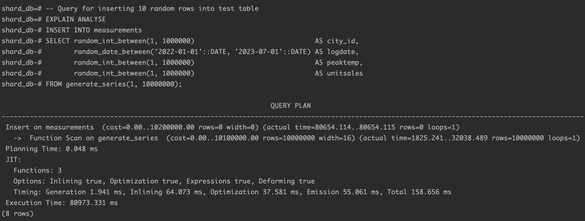
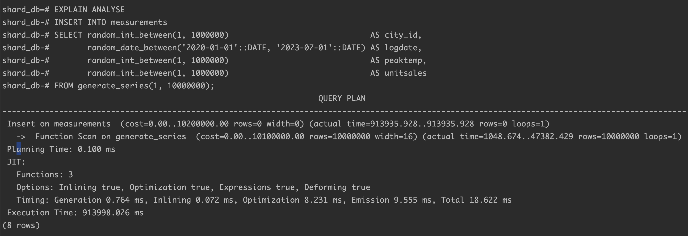
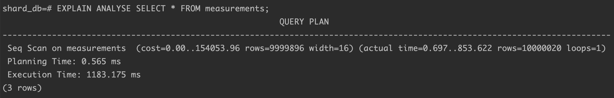
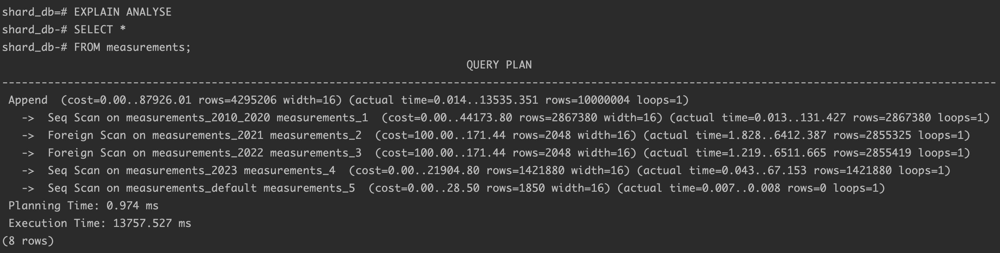
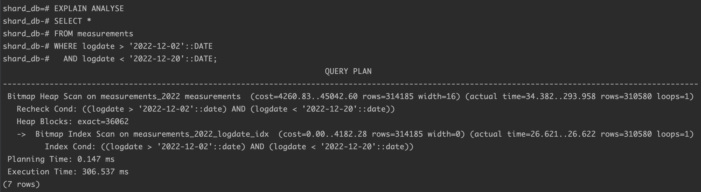
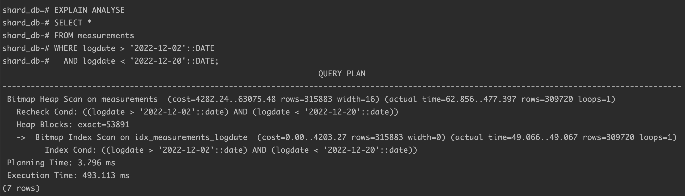
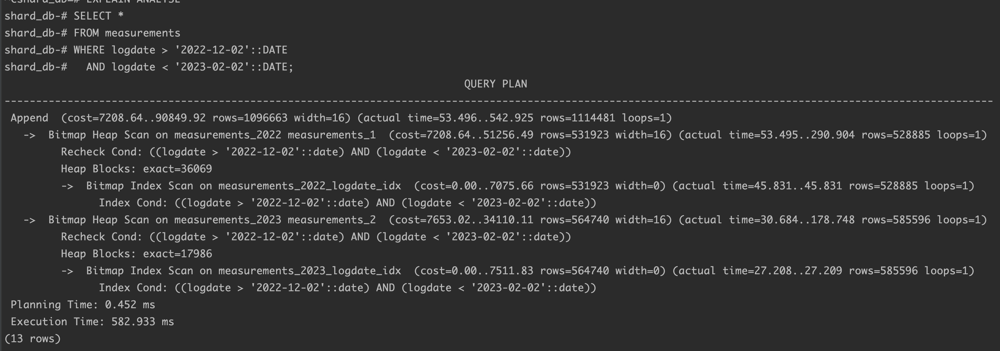
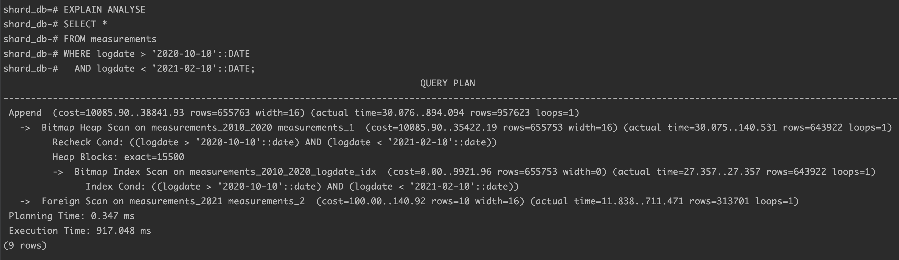
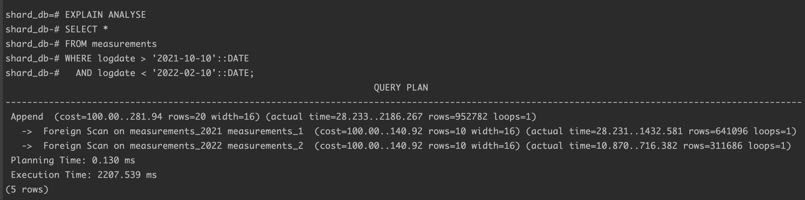

# PRJCTR Homework 21: Database Sharding

The task was to set up horizontal and vertical sharding 
in postgres containers. Insert millions rows into these 
containers and measure their performance.

## Prerequisites

Installed [Docker](https://www.docker.com/products/docker-desktop/).

## Results

I have completed a setup with combined horizontal and 
vertical sharding using postgres foreign data wrapper 
and partitioning technique. Another setup was made only
with vertical sharding using partitioning. And the last
one without any sharding.

To start horizontal and vertical setup execute following command:

```bash
docker-compose up -d postgres-shard-main postgres-shard1 postgres-shard2
```

To start setup only with vertical sharding execute following command:

```bash
docker-compose up -d postgres-partition
```

To start setup without any sharding execute following command:

```bash
docker-compose up -d postgres-regular
```

### Inserting 10M rows

Insertion execution time comparison table:

| Setup name            | Execution time (ms) |
|-----------------------|---------------------|
| No sharding           | 80973.3             |
| Vertical              | 82542.2             |
| Horizontal + Vertical | 913998.0            |

Horizontal sharding is taking too much time comparing to other ones.

Regular setup time execution:



FDW + partitioning insert time execution:



### Select all 10M rows

Selection execution time comparison table:

| Setup name            | Execution time (ms) |
|-----------------------|---------------------|
| No sharding           | 1183.2              |
| Vertical              | 2033.4              |
| Horizontal + Vertical | 13757.5             |

Again, horizontal sharding setup is taking too much time 
comparing to other ones. So it can be a problem in execution
using only machine with docker containers and very limited resources.

Regular setup time execution:



FDW + partitioning selection time execution:



### Selecting small range (~300K rows)

Using vertical partitioning can improve performance much while
there is no need to get data from different partitions.

Vertical sharding select from 1 partition time execution:



No sharding select from 1 partition time execution:



Vertical sharding select from 2 partitions time execution:



Horizontal sharding select from primary and 1 other shard:



Horizontal sharding select from 2 other shards:



Other results can be found in `images` folder.

## Conclusion

When the table grows a lot, it is necessary to make partitions 
(vertical sharding) to keep performance at high level. 
Horizontal sharding can also be used when it is possible to 
divide the load between several physical machines or instances.  